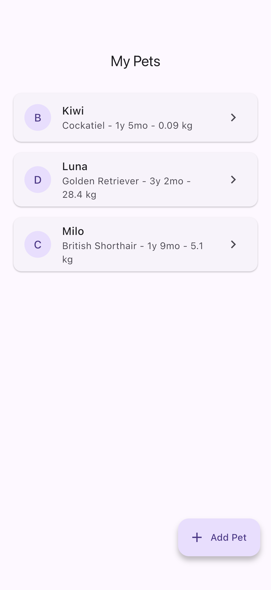
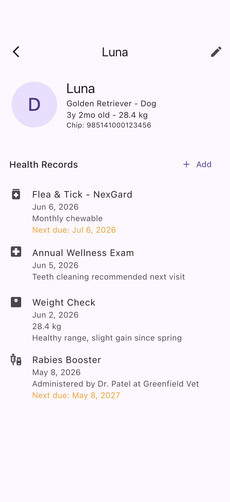
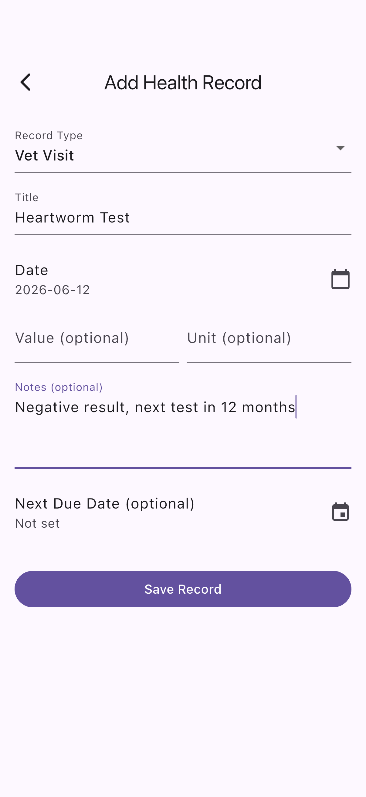
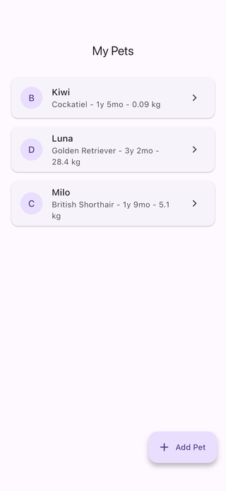

# flutter-pet-health

**PetCare** - A Flutter pet health tracker with profiles, health logs, vaccination records, routine scheduling, and caregiver sharing.

## Demo

Real captures from the running app on the iOS Simulator (no mockups). See [FLOW.md](FLOW.md) for how they were generated.

| Pet list | Pet profile + health timeline | Log health record |
| --- | --- | --- |
|  |  |  |



## Features

- **Pet Profiles** - Name, species, breed, age, weight, microchip ID
- **Health Logs** - Weight tracking, vaccinations, vet visits, medications, symptoms, notes
- **Due Date Tracking** - Next booster dates, next vet visit reminders
- **Routine Scheduling** - Feeding, medication, walk reminders with repeat/weekday selection
- **Caregiver Sharing** - Share pet care responsibilities with family members
- **Offline-first** - All data stored locally with Hive

## Stack

- Flutter + Dart
- Riverpod (state management)
- Hive (local persistence)
- Clean Architecture (features/, core/)
- Material 3 + dark mode

## Getting Started

```bash
flutter pub get
flutter pub run build_runner build
flutter run
```

## Architecture

```
lib/
  core/
    models/      # Pet, HealthRecord, Routine (Hive models)
    providers/   # Riverpod state notifiers
  features/
    pet_list/          # Home screen - list of pets
    pet_detail/        # Pet profile + health history
    add_pet/           # Add/edit pet form
    add_health_record/ # Log a new health event
```
